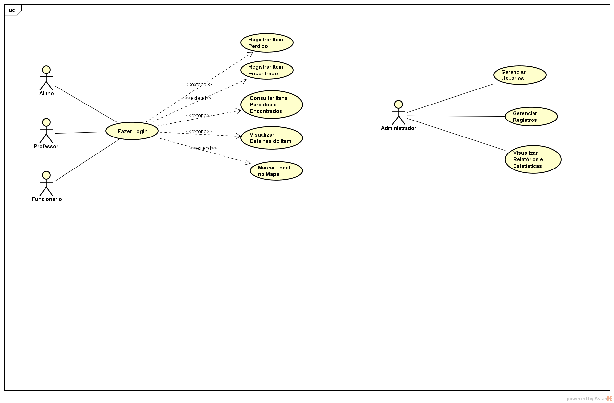
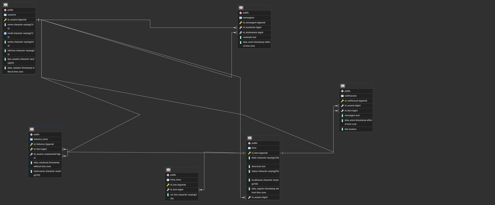

# Achados-E-Perdidos

# Descrição do Projeto
O Aplicativo de Achados e Perdidos do Campus tem como objetivo facilitar a comunicação entre alunos, professores e funcionarios na localizaçãode objetos perdidos dentro do ambiente academico. A plataforma permite o registro de itens perdidos e encontrados, incluindo fotos, descrições detalhadas, local e informações de contato do responsavel pelo cadastro.

Alem disso, o aplicativo conta com um mapa interativo do campus, que auxilia na visualização dos locais onde os objetos foram encontrados ou perdidos, tornando o processo de busca mais rapido e eficiente. Dessa forma, o sistema contribui para a organização, segurança e colaboração entre os membros da comunidade academica, reduzindo o tempo e o esforço necessarios para recuperar pertences extraviados

Link do vídeo de apresentação: https://youtu.be/2UfrLvXkgy4

# Requisitos Funcionais
1. O sistema deve permitir que o usuario realize o cadastro informando nome, email institucional, telefone e senha

2. O sistema deve permitir que o usuario realize login com suas credenciais cadastradas

3. O sistema deve permitir que o usuario registre um item perdido, informando nome do item, descrição, local onde foi perdido, data aproximada e uma foto opcional

4. O sistema deve permitir que o usuario registre um item encontrado, informando nome do item, descrição, local onde foi encontrado, data e foto

5. O sistema deve permitir que qualquer usuario consulte a lista de itens perdidos e encontrados, com opção de filtro por categoria, data ou local

6. O sistema deve exibir as informações completa de um item selecionado, incluindo foto, descrição, data e contato do usuario que registrou o item

7. O sistema deve disponibilizar um mapa interativo do campus para que os usuarios possam marcar o local onde o item foi perdido ou encontrado

8. O sistema deve notificar o usuario quando um item encontrado for semelhante a um item perdido previamente cadastrado

9. O sistema deve permitir que o usuario edite ou exclua seus proprios registros de itens

10. O sitema deve permitir que os usuarios entrem em contato entre si por meio de mensagens internas ou informações de contato(como email ou telefone)

11. O sistema deve permitir que um administrador gerencie usuarios e registros, podendo excluir postagens inapropriadas ou duplicadas

12. O sistema deve manter um historico de itens devolvidos ou recuperados, para controle e estatisticas

# Diagrama de use case

# Modelo Logico (bd)

